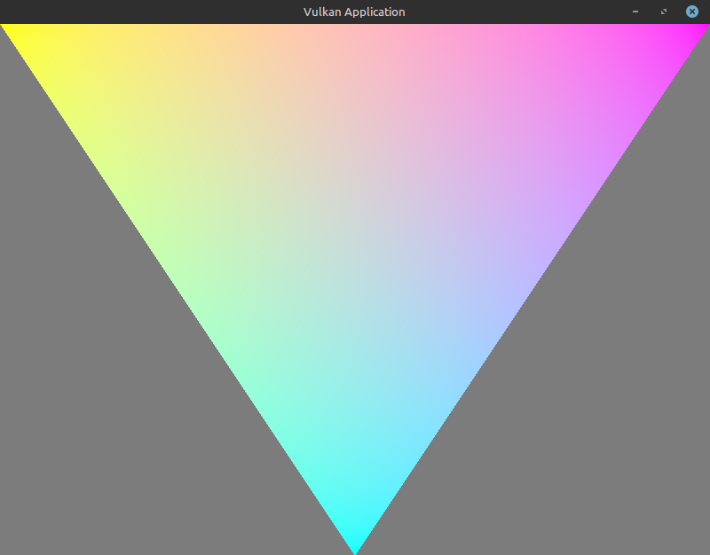
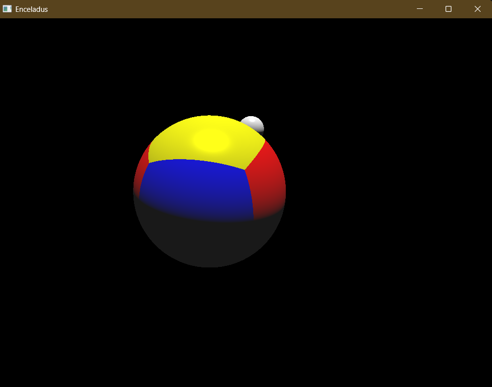
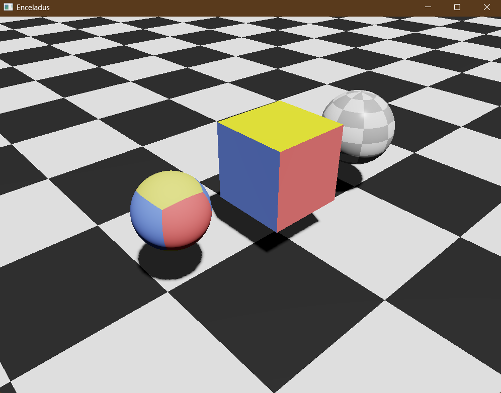

# OXIDE

A 3D renderer that uses the vulkan api 
Nothing too fancy. Just a hobby project i've been working on in my spare time for my love of computer graphics.
I used rust to learn more about the language(i also like abit of pain).

dependencies are in the .toml file.

## learning resources include:
### online 
- https://vulkan-tutorial.com
- https://www.songho.ca/
- https://learnopengl.com/
### Text/Books
- gabor szauer - hands on c++ game animation programming pack 
- Ian Millington - GAME PHYSICS ENGINE DEVELOPMENT(second edition)

## Features inlcude:
- [x] FPS style camera
- [x] directional lighting
- [x] Physical based rendering
- [ ] Multiple point lights
- [ ] shadow-map
- [ ] sky box
- [ ] transparency
- [ ] physics
- [ ] animations

## samples
sample render on linux

sample render on windows

sample PBR render(widows)

